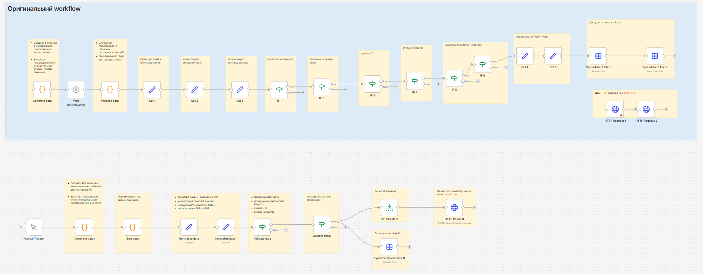

# Описание воркфлоу n8n: task_1.json

## Общее описание
Воркфлоу предназначен для генерации, обработки и валидации тестовых данных о транзакциях клиентов. Он включает два потока: оригинальный поток (Поток 1), предоставленный в задании для оптимизации, и оптимизированный поток (Поток 2), разработанный для улучшения эффективности обработки данных. Основной фокус на оптимизированном потоке с массовой обработкой 400 записей. Воркфлоу фокусируется на очистке, нормализации и валидации данных, а также на экспорте результатов в Excel и выполнении HTTP-запросов для тестирования интеграций.

## Структура воркфлоу

### Основные компоненты
- **Триггер:** Manual Trigger - запуск воркфлоу вручную
- **Генерация данных:** Узлы Code для создания тестовых записей с намеренными ошибками
- **Обработка данных:** Сортировка, фильтрация и нормализация
- **Валидация:** Множественные условия для проверки корректности данных
- **Экспорт:** Создание Excel-файлов из обработанных данных
- **HTTP-запросы:** Тестирование внешних API

### Оригинальный поток (Поток 1) - для сравнения
Это поток, предоставленный в задании, с детальным тестированием на 8 записях, включающий множественные IF-узлы для пошаговой валидации. Он менее эффективен для больших объемов данных.

### Оптимизированный поток (Поток 2) - основная реализация
1. **Generate data1** - Генерирует 400 записей с разнообразными ошибками (невалидные email, отрицательные суммы, пустые значения)
2. **Sort data** - Сортировка данных для упорядочивания
3. **Normalize data** - Первичная нормализация полей (email в lowercase, trim, конвертация amount в число)
4. **Normalize data1** - Дополнительная нормализация (обработка валют, статусов)
5. **Validate data** - Валидация данных с использованием условий
6. **Validate data1** - Финальная валидация и фильтрация корректных записей
7. **Export to Spreadsheet1** - Экспорт валидных данных в Excel
8. **Get first item** - Извлечение первой записи для дополнительной обработки
9. **HTTP Request** - HTTP-запрос на основе первой записи для тестирования интеграции

