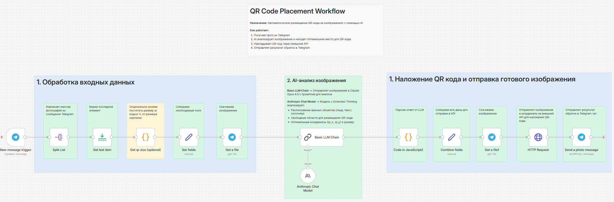

# Описание воркфлоу n8n: Qr Test.json

## Общее описание
Воркфлоу "Qr Test" предназначен для автоматического размещения QR-кодов на изображениях с использованием искусственного интеллекта. Это Telegram-бот, который получает фотографии от пользователей, анализирует их с помощью LLM-моделей (Claude от Anthropic), определяет оптимальное место для размещения QR-кода, накладывает QR-код через внешний API и отправляет результат обратно в чат. Воркфлоу интегрирует Telegram API, AI-анализ изображений и HTTP-запросы к локальному серверу для обработки изображений.

## Структура воркфлоу

### Основные компоненты
- **Триггер:** Telegram Trigger - срабатывает на новые сообщения с фотографиями
- **Обработка входных данных:** Извлечение и подготовка изображений
- **AI-анализ:** Анализ изображений с помощью LLM для выбора позиции QR-кода
- **Наложение QR-кода:** HTTP-запрос к внешнему API для генерации и наложения QR
- **Отправка результата:** Возврат обработанного изображения в Telegram

